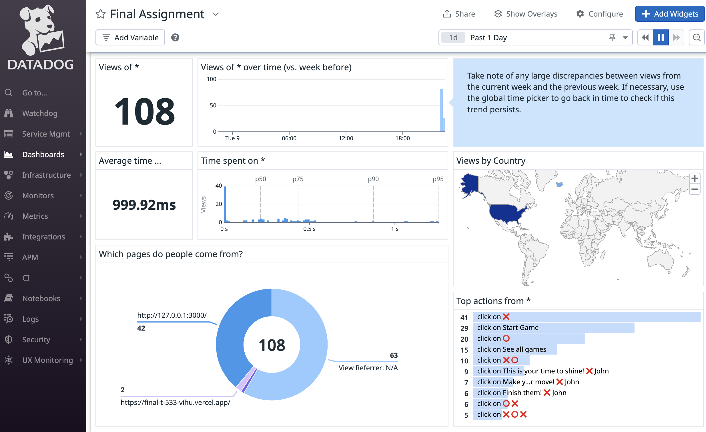

# Assignment Final

### Vercel Production & Preview URLs:

- [ 🌍 Production using DB(PROD)](https://final-t-533-vihu.vercel.app/)
- [🌐 Preview using DB(DEV)](https://final-t-533-vihu-4u9wkfca7-einar-tomas-projects.vercel.app/)

### Datadog Dashboard Image

### Eslint Repo

- [ 🧹 Eslint No Momnet repo link](https://github.com/ETG01/2_FINAL_ESLINT)

#### The full circle

---

This is it. The Big one. Now it's time to put all our learnings into one final project. In this assignment you will be setting up a CD pipeline with all the steps done in previous assignments.

What you will be working with is a Tic Tac Toe game that needs maintenance. Some logic is needed to complete the game and it is untested, some libraries are outdated and need to be updated.

The Project is a NextJS application with a Postgres database to keep track of the games.

**Please remember** to commit and push often (meaningful commits), the Git history is part of the assignment (only the history on the `main` branch).

**Group size**: 1 person

---

## The Assignment

#### **Fix it!**

- 1. Currently the game can only tell when someone wins, but not when there is a draw. Write a test for such function and then implement it and add that to the game. `FINSIHED`
- 2. Should the game be playable without the players names ? awnser == `Yes`, the game should be playable without the players names to accommodate users who might prefer not to enter their names, ensuring the game remains accessible and user-friendly. Additionally, allowing gameplay without requiring names respects personal privacy, catering to those who wish to keep their identity private. This approach makes the game accessible since players can identify themselves as ❌ or ⭕, and the game can still proceed smoothly without requiring names. It not only enhances the flexibility of the game but also promotes a privacy-conscious environment, ensuring all players can enjoy the game comfortably, regardless of their privacy preferences.`FINSIHED`
- 3. Create a new GitHub repository with one eslint rule that forbids moment. Release that package, using GitHub Actions, and use that in this project. `FINSIHED`
- 4. There should be lint errors/warnings after applying that rule, fix it. `FINSIHED`
- 5. Make the code and relevant files pretty. `FINSIHED`
- 6. There are no unit tests. Add them. `FINSIHED`
- 7. There are no ui integration tests. Add them. `FINISHED`
- 8. There are no e2e tests. Add them. `FINISHED`

#### **Deploy it!**

- 1. Create a GitHub action that does all the checks we've been doing in previous assignments and then deploys the application using Vercel. Please note the checks should be done on any branch but the production deployment should only happen on the `main` branch. All other branches should use the preview deployment. `FINSIHED`
- 2. Add a link to the application running to this README.md file Working on `FINSIHED`

#### **Monitor it!**

- 1. Add Datadog RUM (Real user monitoring) to the application. `FINSIHED`
- 2. Create a dashboard to monitor the health of the application. `FINSIHED`
- 3. Add a screenshot of the dashboard to this README.md file `FINSIHED`

---

### Prerequisite

Copy the GitHub repo into your own repository and make it private. `FINSIHED`

Node v20 is required for this project to run.

We will be using [Vercel](https://vercel.com/) to deploy the application.

#### Setup your dev environment

Create a two free Postgres database. One for dev/staging and another for Production.
Here is one free services you can utilize, but feel free to choose any Postgres hosting service you like.

- [Supabase](https://app.supabase.com/)

Get your connection string and add that to your ENV as ´DATABASE_URL´ `FINSIHED`

### Helpful Commands

Run the following commands to get started:

`npm install`

`npm run prisma:init`
npx prisma generate

`npm run dev`

npx playwright install

And make sure to look into `package.json` for other commands, and feel free to add commands required for this assignment.

## Hand in

Add me (arnif) as collaborator to both repositories. Add a screenshot of your Datadog dashboard to the README.md and also add link to your Eslint rule GitHub repository to the README.md of this project.

Also make sure to send the GitHub link to this repository in Canvas when handing in the assignment.

Good luck and Have fun :)
